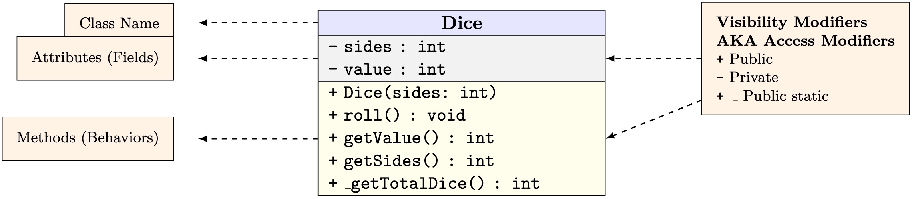
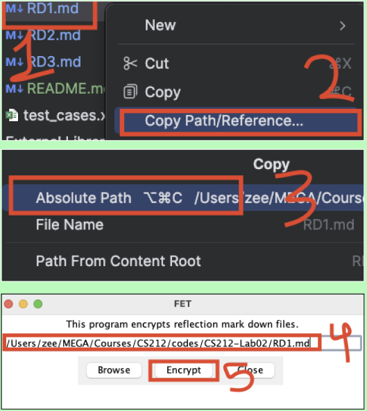

<h1> Lab 04 -- A Greyhound Grocers Cashier </h1>

<h2> 50 Points </h2>

<h2> Table of Contents </h2>

<!-- TOC -->
* [`I. DEADLINES`](#i-deadlines)
* [`II. RESOURCES`](#ii-resources)
* [`III. PURPOSE`](#iii-purpose)
* [`IV. PROBLEM`](#iv-problem)
* [`V. REQUIREMENTS`](#v-requirements)
    * [Tester/Driver/Main Class:](#testerdrivermain-class)
* [Quick note:](#quick-note)
* [`VI. STYLE`](#vi-style)
* [`VII. REMINDERS`](#vii-reminders)
* [`V. SUBMISSIONS`](#v-submissions)
<!-- TOC -->

<h4> ⛔️ Do Not start coding before completing your algorithm ⛔️ </h4>

<h4> 🔵 Understand the problem and Design before Coding 🔵 </h4>

**🔵 Post any questions on [Discord Lab Channel](https://discord.com/channels/1325897175544369263/1325897175544369272) 🔵**

---

## `I. DEADLINES`

| Deliverable | Due Date        |
|-------------|-----------------|
| Lab 04      | Before next lab |
---

## `II. RESOURCES`

- [Class Examples Repo](https://github.com/SP25-ZJY/CS212)
- [Self or Annotated Notes](https://moodle.loyola.edu/course/view.php?id=89009)
- [CS 212: Book](https://open.umn.edu/opentextbooks/textbooks/java-java-java-object-oriented-problem-solving)
- [Solutions To Previous Labs and PAs](https://classroom.github.com/classrooms/193636664-sp25-zjy-cs212)

**🟠 LLM-Based Codes Will Result in Penalty and Honor Code Violation 🟠**

## `III. PURPOSE`

In this assignment, you will practice  creating a class and demonstrating its capabilities.

## `IV. PROBLEM`
A sphere is a rounded shape 3-dimensional object which has a center and a radius.
- In this assignment, you will define your Sphere class and use it to create sphere objects and to detect sphere collusion among all the spheres.

In computer games, spheres are used to model many spherical objects:
- the sun, the moon, the earth, a cannonball, a soccer ball, a baseball, a raindrop, etc...
- You will create a new class named Sphere after creating a file `Sphere.java`.


## `V. REQUIREMENTS`
It is up to you how to design the class, but it needs to meet the following requirements:

1. All attributes (x,y,z, and radius) must be private.
2. A constructor that sets all the attributes to 0 (coordinate of the center and the radius)
3. A constructor that sets the center and radius by accepting 4 double values (3 for the coordinate and 1 for the radius)
4. An accessor method for radius.
5. A mutator method for radius.
6. A toString method to help print out a Sphere object nicely.
7. A method to calculate the surface area of the sphere.
8. A **static** method to detect whether a sphere collides with another sphere (the spheres intersect).
9. A method of your choosing (Cannot be an accessor/mutator aka. getter/setter)

**The spheres are intersected if the distance between the centers is less than the sum of the two radii.**
- It is helpful to write out an algorithm for the check collusion method.

### Tester/Driver/Main Class:

Create a class to test your Sphere class named: `SphereTest.java`
- Use codes as below in the `main()` method that utilizes the Sphere class.
    - You should add code to instantiate 2 more Sphere objects and test other methods.
```java
    // create a sphere called sun
    Sphere sun = new Sphere(0.0, 0.0, 0.0, 10.545);
    // create a sphere called earth
    Sphere earth = new Sphere(21.0, 21.0, 21.0, 24.2);
    // create a sphere called moon
    Sphere moon = new Sphere(-2.0, -3.1, -15.0, .001);

    // output the surface area of the sphere objects
    System.out.println("The surface area of the sun is " + sun.calculateSurfaceArea());
    System.out.println("The surface area of the earth is " + earth.calculateSurfaceArea());
    System.out.println("The surface area of the moon is " + moon.calculateSurfaceArea());
```


## Quick note:
- If you want a quick read about spheres go [here](https://byjus.com/maths/sphere/#:~:text=A%20sphere%20is%20a%20three,vertices%2C%20like%20other%203D%20shapes).
- Complete the design of your Sphere class in (`algorithm file`)[algorithm.md].
- 🟣When designing a class follow the [template here](CLASS_DESIGN_TEMPLATE.md).🟣
- 🟩When **designing a UML** see the sample and meaning below🟩




## `VI. STYLE`

You are expected to follow a consistent style. Pay particular attention to:

1. File headers: You should have a file header at the top of every file explaining the purpose and author of the file, describing input/output if any.
   It must start with (replace the bits in < >):
  ```java
  /**
   * [Brief description of the file's purpose]
   * Due Date: [date assignment is due]
   * Assignment:  [number of assignment]
   * Problem Statement:  [what problem does your code solve; i.e., calculating inches from centimeters]
   * Data In: [what information do you request from the user?]
   * Data Out:  [What information do you display for the user?]
   * @author <Your Name>
   * @version <Version Number, Date>
   */
  ```

2. Variable names: use meaningful names in all camelCase style
3. Your code should have appropriate whitespace and avoid overly long line lengths.
4. Use clear documentation and careful formatting. Be consistent in the indentation and alignment of braces.
5. Every method in your class must have a header comment of the form (replace the bits in < > and only use the number of `@param` that are needed for your method):
    ```java
    /**
    * <A one sentence description of the method, ending with a period.>
    * <Optional longer description if desired>
    *
    * @param  <first parameter name>  <purpose of the parameter>
    * @param  <second parameter name>  <purpose of the second parameter>
    * @return      <what is returned>
    */
    ```
6. Your code should have no compilation errors.
7. Use of git: use meaningful commit messages and commit after reasonable milestones (i.e., a function has been completed)
    * A single commit for the whole project is not a good use of git


[<h2>⬆ Back To Top ⬆</h2>](#i-deadlines)


## `VII. REMINDERS`

You will write your program in the "pair programming" mode: one of you is the driver while the other is the navigator.

1.  ⛔️ Make sure you *understand the problem* you are being asked to solve.
- What are the input(s), output(s), and calculation(s)?
2. ✅ *Write Test Cases*: create a series of test cases in [test_cases.xlsx](test_cases.xlsx) to use to determine that your program works correctly.
    - Double check your test cases. Make sure they cover a wide range of cases.
3. ✅ *Complete the algorithm* in [algorithm.md](algorithm.md).
- **Whoever didn't type the majority of the test cases, should type the algorithm**
- Your program should do ALL of the calculations for you, and it should work for ANY valid inputs.
- You do not need to do error checking, yet.

4. ✅ *Code*: Your code should be in [Main.java](Main.java) and follow your algorithm to write your code.
- You may assume that your input will always be of the correct type.
- Whoever has done the least typing at this point should start as a driver.

5. ❌ *Fix compiler errors*: Run your program and fix any errors that appear.

6. ❌ *Test:* Once your code runs and you think it’s complete, test it using your test cases.
- run, give the input value as input, and see if you get the right output.
- If not, you need to fix the error(s) in your code!

7. ✳️ Make sure you’ve created a human-readable essay (i.e. your program).
- Did you follow the code readability guidelines?
    - If not, fix your code so that it is readable.
- You should have comments above each chunk of code!
- Use white spaces to make your code more readable and lastly be consistent and considerate in naming your variables (**use camel Case style**)


9.  Once you are done in lab, even if you haven’t finished the assignment yet, you need to Commit and Push your changes.


## `V. SUBMISSIONS`

**🔶 Commit and Push to GitHub: 🔶**

1. Completed `Sphere.java` file
2. Completed `SphereTest.java` file
2. Your design on `algorithm.md` file
3. UML design in `flowchart_uml.drawio.svg`file
4. An Excel file with your test cases.
    - Edit the `test_cases.xlsx` file with Excel software
        - Containing at least 3 test cases.
    - If it can open then ok. Otherwise
        - Right click on `test_cases.xlsx` -> Open In -> Associated Application
5. Encrypted reflection files using the `FET.java`:
    - `RD1.md`: Reflection for Driver 1.
    - `RD2.md`: Reflection for Driver 2.
    - `RD3.md`: Reflection for Driver 3. (If there are three members)
    - N.B. You can get the path of the reflection file and paste it inside the fet browser
        - **Unencrypted reflection will be considered unsubmitted**
    - 

[<h2>⬆ Back To Top ⬆</h2>](#i-deadlines)
